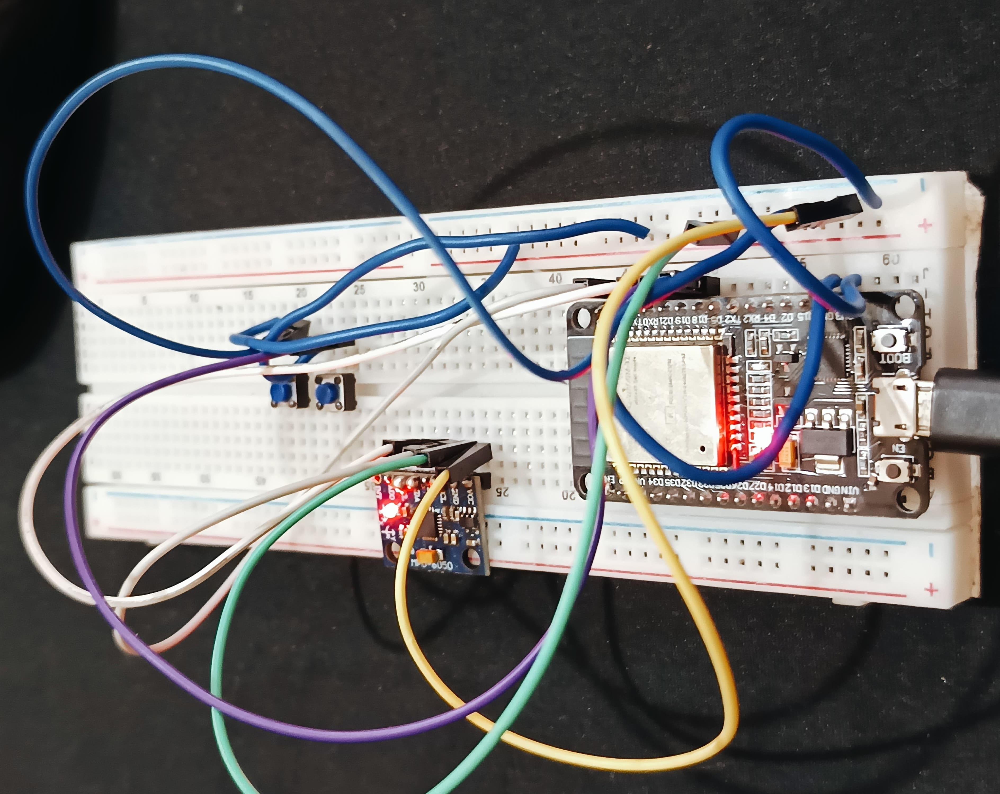
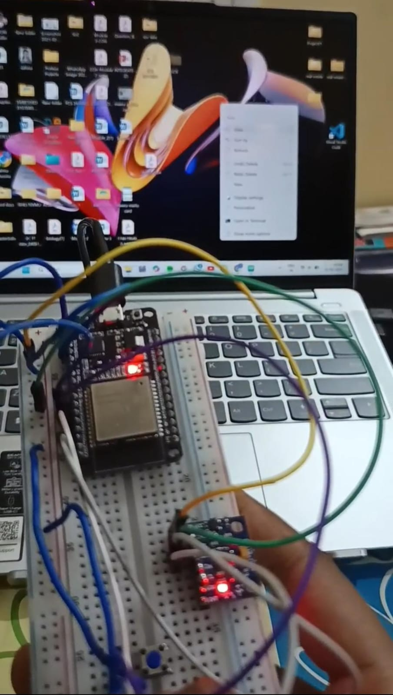

# 🖱️ AirMouse - Gesture Based Cursor Control

A **gesture-controlled wireless mouse** built using **ESP32** and **MPU6050**, enabling **touchless cursor movement** and **button-based mouse clicks** over Bluetooth. This project is designed for **differently-abled users** and **innovative interfaces** like **VR/AR** and **wearables**.

---

## 📄 Overview

This project uses:
- The **MPU6050 IMU sensor** to detect hand movements (gyroscope-based)
- The **ESP32** microcontroller to process sensor data and communicate as a **Bluetooth HID mouse**
- **Two pushbuttons** for left and right mouse clicks

All interactions are sent to the host computer over **Bluetooth**, allowing complete **hands-free, wireless mouse control**.

---
## 🔌 Circuit Diagram


---

## 🚀 Features

- 🎮 **Real-time gesture-based cursor movement**  
- 🖱️ **Left and right click support** using pushbuttons  
- 📡 **Bluetooth HID interface** using ESP32  
- ♿ Ideal for **accessibility** solutions  
- 🕹️ Great for **VR/AR, wearable devices**, or **smart environments**

---

## 🎯 Applications

- ✅ **Assistive technology** for differently-abled individuals  
- ✅ **Touchless mouse control** in smart/clean environments  
- ✅ **Wearable computing and gesture interaction**  
- ✅ **Virtual/Augmented Reality input**

---

## 🔧 Components Used

| Component          | Quantity | Description                                  |
|-------------------|----------|----------------------------------------------|
| ESP32-WROOM-32     | 1        | Microcontroller with Bluetooth support       |
| MPU6050 IMU        | 1        | 3-axis Gyroscope + 3-axis Accelerometer      |
| Pushbutton         | 2        | Left and Right click controls                |
| Breadboard         | 1        | For prototyping                              |
| Jumper Wires       | Several  | To connect all components                    |

---
## 🖼️ Demo


---

## 🧰 Software and Libraries

- **Arduino IDE**
- ESP32 Board Package for Arduino
- Required Libraries:
  - `BleMouse.h` (by T-vK)  
  - `Adafruit_MPU6050`  
  - `Adafruit_Sensor`

---

## 🧠 Working Principle

- **Hand movements** are captured using the gyroscope of the **MPU6050**.
- **Gyro Z** → Horizontal (X-axis) cursor movement  
- **Gyro X** → Vertical (Y-axis) cursor movement  
- Movement is scaled and sent as **BLE HID mouse events**.
- **Left/Right click** is handled via external pushbuttons.

---

## 💻 Arduino Code

```cpp
#include <BleMouse.h>
#include <Adafruit_MPU6050.h>
#include <Adafruit_Sensor.h>

#define LEFTBUTTON 19
#define RIGHTBUTTON 18
#define SPEED 10

Adafruit_MPU6050 mpu;
BleMouse bleMouse("ESP32_AirMouse", "SahinaTech", 100);

void setup() {
  pinMode(LEFTBUTTON, INPUT_PULLUP);
  pinMode(RIGHTBUTTON, INPUT_PULLUP);
  bleMouse.begin();
  mpu.begin();
  mpu.enableSleep(false);
}

void loop() {
  if (bleMouse.isConnected()) {
    sensors_event_t a, g, temp;
    mpu.getEvent(&a, &g, &temp);

    int dx = (int)(g.gyro.z * -SPEED * 10);
    int dy = (int)(g.gyro.x * -SPEED * 10);

    if (abs(dx) > 1 || abs(dy) > 1)
      bleMouse.move(dx, dy);

    if (!digitalRead(LEFTBUTTON))
      bleMouse.click(MOUSE_LEFT);

    if (!digitalRead(RIGHTBUTTON))
      bleMouse.click(MOUSE_RIGHT);
  }

  delay(20);
}
````

---


## 🧑‍💻 Author

**Sahina Parbin**
📧 [sahina.23ece@cambridge.edu.in](mailto:sahina.23ece@cambridge.edu.in)
📍 Cambridge Institute of Technology, Bengaluru
